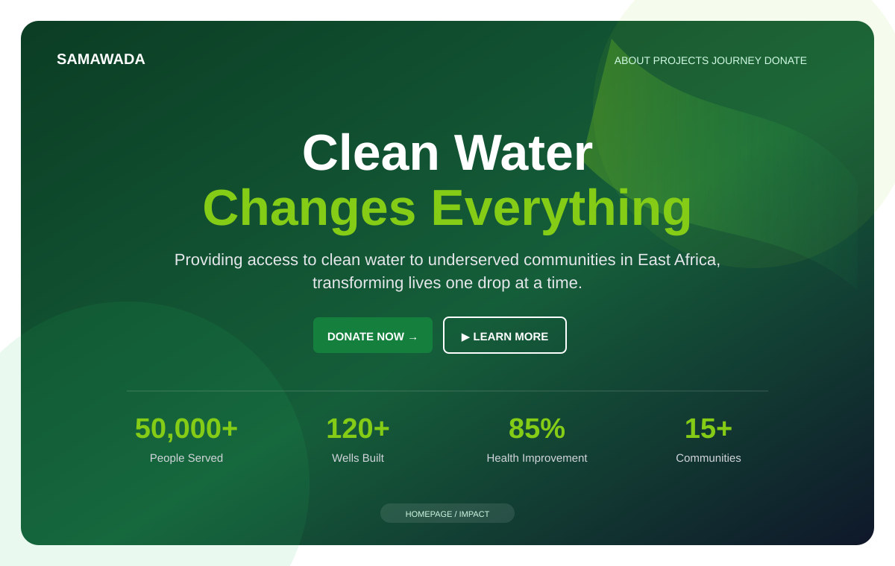
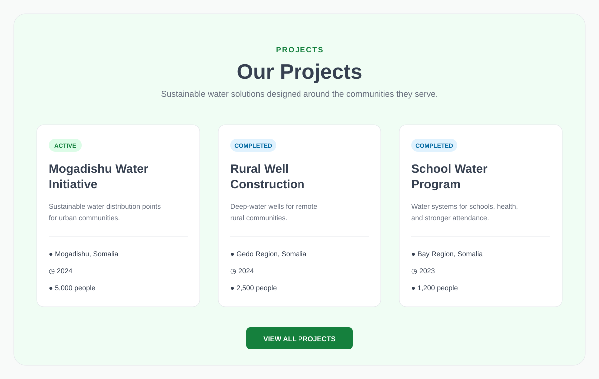
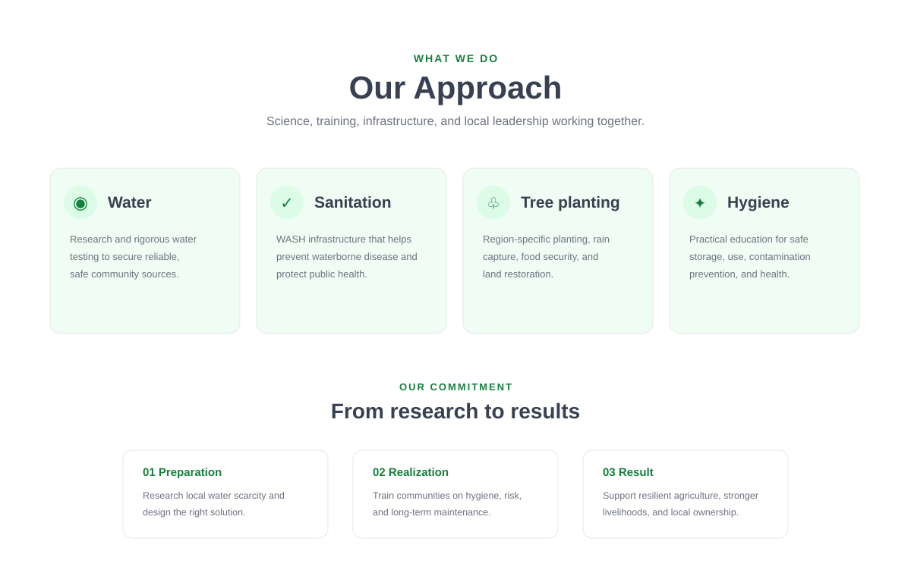
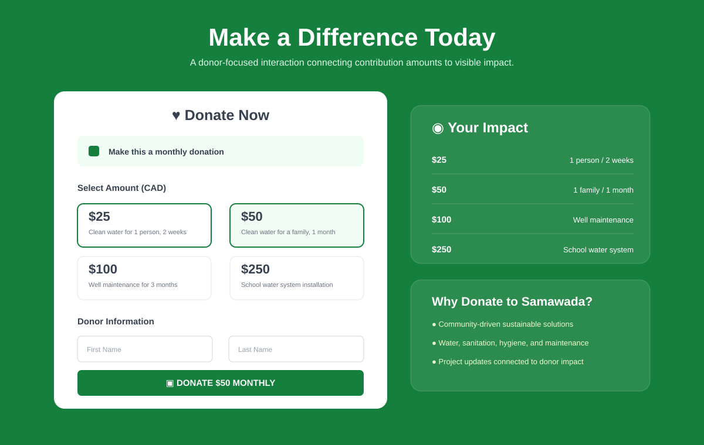

# Samawada

**A responsive nonprofit website built with Next.js and TypeScript, focused on clean-water access, community-led development, project storytelling, and a clear donor journey.**

Samawada is a multi-page web experience designed to make a complex humanitarian mission easy to understand. The site connects visitors with clean-water projects, the organization's approach, founder story, team, community impact, upcoming events, and an interactive donation experience.

**[View the live demo](https://kyla-zeit.github.io/samawada/)**

## Product preview

<p align="center">
  
  &nbsp;
  
</p>

<p align="center">
  <strong>Homepage</strong>: mission-led hero, donor CTA, clean-water positioning, and high-level impact metrics.<br/>
  <strong>Projects</strong>: active and completed initiatives presented with location, year, status, and people served.
</p>

<p align="center">
  
  &nbsp;
  
</p>

<p align="center">
  <strong>Our Approach</strong>: water, sanitation, tree planting, hygiene, and a research-to-results delivery model.<br/>
  <strong>Donation experience</strong>: one-time or monthly support, preset/custom amounts, donor information, and impact context.
</p>

> The portfolio previews above are source-faithful visualizations based directly on the current Next.js components, labels, content structure, and green / lime / white design system. The live GitHub Pages build is the authoritative interactive demo.

## Project at a glance

| Area | Implementation |
| --- | --- |
| Framework | Next.js 14 App Router |
| Frontend | React 18 + TypeScript |
| Styling | Tailwind CSS 4 + custom design tokens |
| UI layer | Radix UI primitives + reusable components |
| Icons | Lucide React |
| Theme support | `next-themes` with light/dark tokens |
| Deployment | Static Next.js export to GitHub Pages |
| Primary experience | Nonprofit storytelling, project discovery, and donor engagement |

## The experience

The application is structured around a simple visitor journey:

```text
Visitor
   |
   +-- Understand the mission
   |      |
   |   Homepage / Impact
   |
   +-- Explore the work
   |      |
   |   Projects / Our Approach
   |
   +-- Understand the story
   |      |
   |   Journey / Team
   |
   +-- Take action
          |
      Donate / Contact / Events
```

The goal is to move from **why the work matters** to **what is being done** to **how someone can participate** without burying the visitor in organizational complexity.

## Core experience

### Mission-led homepage

The homepage opens with a full-screen clean-water hero and two direct actions: **Donate Now** and **Learn More**.

The hero combines:

- Full-bleed imagery with a dark readability overlay
- Responsive headline and supporting copy
- Smooth in-page navigation
- Four impact metrics
- Staggered entrance animation
- Scroll indicator

The current impact presentation includes people served, wells built, health improvement, and communities reached.

The rest of the homepage is composed from reusable sections for the organization overview, projects, events, community voices, and donation flow.

### Project discovery

The Projects section presents water initiatives as structured data rather than generic marketing cards.

Each project includes:

- Active or completed status
- Project title and summary
- Location
- Year
- People served

Current project examples include the **Mogadishu Water Initiative**, **Rural Well Construction**, and **School Water Program**.

This format makes project scope and status quickly scannable while keeping the component easy to extend with additional records.

### Our Approach

The `/what-we-do` route explains the operating model through four core areas:

| Area | Focus |
| --- | --- |
| Water | Research, testing, safe sources, and reliable access |
| Sanitation | WASH infrastructure and waterborne-disease prevention |
| Tree planting | Land restoration, rain capture, food, and income support |
| Hygiene | Safe storage, use, contamination prevention, and education |

The page then turns the broader mission into a three-step implementation model:

```text
Preparation
    |
Research local conditions
    |
Realization
    |
Training + infrastructure + maintenance
    |
Result
    |
Resilient livelihoods and local ownership
```

This gives the site a stronger information architecture than a simple list of causes or programs.

### Founder journey

The `/journey` route is a long-form narrative page focused on displacement, migration, return to Somalia, community resilience, gender inequality, climate impacts, and the path that led to Samawada's founding.

The page uses a narrow reading column, strong heading hierarchy, and minimal visual interruption so the story can function as editorial content rather than another card grid.

### Team presentation

The `/our-team` route presents leadership profiles with:

- Portraits
- Role labels
- Short biographies
- Email / LinkedIn / website actions where supplied
- Responsive team grid
- Support and contact calls to action

Reusable `TeamCard` and `SocialIcon` components keep profile presentation consistent while preserving accessible labels and focus states.

### Interactive donation flow

The donation section is a client-side React experience with controlled state for:

- One-time or monthly giving
- Preset amounts of $25, $50, $100, and $250
- Custom donation amount
- First and last name
- Email
- Optional phone number
- Dynamic submit-button copy
- Validation before the action is available

Each preset amount is paired with an impact statement so the user sees context alongside the contribution amount.

> **Current scope:** the donation interface is a front-end demonstration. The current handler validates the amount and displays a message describing a future secure-payment redirect. It does not collect payment details or send money to a payment processor.

## Information architecture

The current App Router structure includes:

| Route | Purpose |
| --- | --- |
| `/` | Main homepage and donor journey |
| `/home` | Homepage alias |
| `/what-we-do` | Water, sanitation, environment, and hygiene approach |
| `/journey` | Founder story and organizational origin |
| `/our-team` | Leadership profiles and contact actions |

The root layout provides shared navigation, footer content, theme support, fonts, and metadata across the application.

## Design system

The visual system is intentionally clear and optimistic without becoming visually noisy.

### Colour

- White primary background
- Deep green primary actions
- Lime-green accent
- Pale green cards and supporting surfaces
- Neutral grey body copy and borders
- Dedicated dark-mode palette

### Typography

The root layout loads **Work Sans** and **Open Sans** through `next/font`, with the interface using clear weight and spacing changes rather than excessive decorative styling.

### Interaction and accessibility

The project includes:

- Semantic section structure
- Accessible labels on interactive profile links
- Keyboard-visible focus states
- Smooth anchor scrolling
- Responsive navigation
- Reduced-motion support for entrance animations
- Scroll offsets for anchored sections beneath the fixed header
- Native input types for email, phone, and numeric donation amounts

The global CSS explicitly disables the fade-up animation for users who prefer reduced motion.

## Component architecture

The homepage is assembled from focused reusable sections:

```text
HomePage
   |
   +-- HeroSection
   +-- AboutSection
   +-- ProjectsSection
   +-- UpcomingEventsSection
   +-- TestimonialsSection
   +-- DonationSection
```

The wider application adds shared layout and content components:

```text
RootLayout
   |
   +-- ThemeProvider
   +-- Header
   +-- Page content
   +-- Footer

Additional content
   |
   +-- WhatWeDoContent
   +-- Team cards
   +-- Radix-based UI primitives
```

This keeps the site modular while still allowing GitHub Pages to serve it as a static export.

## Static deployment architecture

The application uses Next.js static export rather than requiring a Node server in production.

```text
Push to main
     |
     v
GitHub Actions
     |
     +-- npm ci
     +-- next build
     +-- static export to /out
     +-- .nojekyll
     |
     v
GitHub Pages
```

The Next.js configuration supplies the production `/samawada` base path and asset prefix, enables `trailingSlash`, and disables Next Image optimization so exported images work correctly on GitHub Pages.

## Tech stack

```text
Next.js 14.2
React 18
TypeScript 5
Tailwind CSS 4
Radix UI
Lucide React
next-themes
React Hook Form / Zod dependencies
GitHub Actions
GitHub Pages
```

## Run locally

Requirements:

- Node.js 20+
- npm

Install dependencies:

```bash
npm install
```

Start the development server:

```bash
npm run dev
```

Then open:

```text
http://localhost:3000
```

## Build

Create the production static export with:

```bash
npm run build
```

The Next.js configuration writes the exported site to `out/`.

## Project structure

```text
samawada/
├── .github/
│   └── workflows/
│       └── pages.yml
├── app/
│   ├── home/
│   ├── journey/
│   ├── our-team/
│   ├── what-we-do/
│   ├── globals.css
│   ├── layout.tsx
│   └── page.tsx
├── components/
│   ├── ui/
│   ├── about-section.tsx
│   ├── donation-section.tsx
│   ├── header.tsx
│   ├── hero-section.tsx
│   ├── projects-section.tsx
│   ├── testimonials-section.tsx
│   ├── upcoming-events-section.tsx
│   └── what-we-do-content.tsx
├── docs/
│   └── assets/                 # README portfolio previews
├── public/
├── next.config.mjs
├── package.json
└── README.md
```

## Scope

Samawada is a portfolio-scale nonprofit web application focused on responsive front-end engineering, information architecture, content presentation, donor UX, and static deployment.

The current project does not include a production payment gateway, donation database, CMS, authenticated administration area, or server-side form processing. Those would be separate production integrations rather than features implied by the front-end prototype.